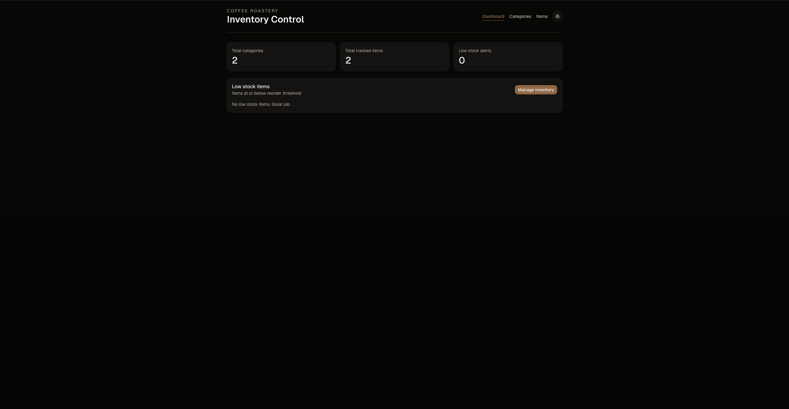

# Inventory Application



Management dashboard for [The Odin Project](https://www.theodinproject.com/).

[Source Repository](https://github.com/ChiefWoods/inventory-application)

## Features

- Perform CRUD actions on a database
- Auth-gated admin-only actions

## Built With

### Tech Stack

- [](https://react.dev/)
- [](https://reactrouter.com/)
- [](https://elysiajs.com/)
- [](https://orm.drizzle.team/)
- [](https://ui.shadcn.com/)
- [](https://vitest.dev)
- [](https://www.docker.com/)

## Getting Started

### Prerequisites

Update your Bun toolkit to the latest version.

```bash
bun upgrade
```

### Setup

1. Clone the repository

```bash
git clone https://github.com/ChiefWoods/inventory-application.git
```

2. Install all dependencies

```bash
bun install
```

3. Follow the steps in [app](./app/README.md) and [api](./api/README.md)

## Issues

View the [open issues](https://github.com/ChiefWoods/inventory-application/issues) for a full list of proposed features and known bugs.

## Acknowledgements

### Resources

- [Shields.io](https://shields.io/)
- [Lucide](https://lucide.dev/)

### Hosting

- [Render](https://render.com/)
- [Neon](http://neon.com/)

## Contact

[chii.yuen@hotmail.com](mailto:chii.yuen@hotmail.com)
